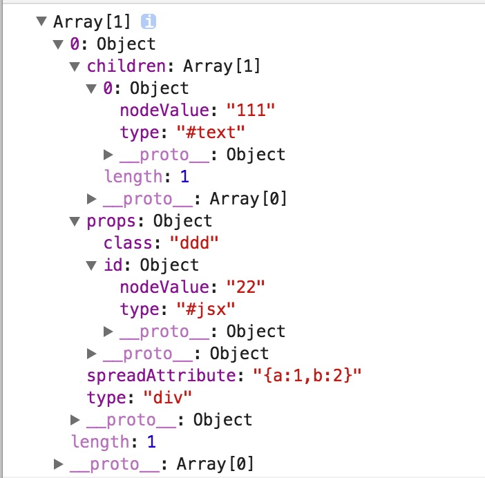

# jsx-parser

## a lightweight jsx parser

npm

```
npm install jsx-parser
```

how to require

```
import JSXParser form 'index'
```

or 
```html
<script src="index.umd"></script
```

how to use
```javascript

var str = '<div><div id={ 2222 } kkk={<div/>} class="{111}" >xxx{[1,2,3,4].map(function(el){ return <div ref=3 >{el}</div> })}22</div><div><div ref=111>{55}</div></div></div>'
 // 用渲染函数构建虚拟模版类
var array = (new JSXParser(str)).parse()
console.log(JSON.stringify(array))

 ```
output

```json
[
    {
        "type": "div", 
        "props": { }, 
        "children": [
            {
                "type": "div", 
                "props": {
                    "id": {
                        "type": "#jsx", 
                        "nodeValue": " 2222 "
                    }, 
                    "kkk": {
                        "type": "#jsx", 
                        "nodeValue": [
                            {
                                "type": "div", 
                                "props": { }, 
                                "children": [ ], 
                                "isVoidTag": true
                            }
                        ]
                    }, 
                    "class": "{111}"
                }, 
                "children": [
                    {
                        "type": "#text", 
                        "nodeValue": "xxx"
                    }, 
                    {
                        "type": "#jsx", 
                        "nodeValue": [
                            {
                                "type": "#jsx", 
                                "nodeValue": "[1,2,3,4].map(function(el){ return "
                            }, 
                            {
                                "type": "div", 
                                "props": {
                                    "ref": "3"
                                }, 
                                "children": [
                                    {
                                        "type": "#jsx", 
                                        "nodeValue": "el"
                                    }
                                ]
                            }, 
                            {
                                "type": "#jsx", 
                                "nodeValue": " })"
                            }
                        ]
                    }, 
                    {
                        "type": "#text", 
                        "nodeValue": "22"
                    }
                ]
            }, 
            {
                "type": "div", 
                "props": { }, 
                "children": [
                    {
                        "type": "div", 
                        "props": {
                            "ref": "111"
                        }, 
                        "children": [
                            {
                                "type": "#jsx", 
                                "nodeValue": "55"
                            }
                        ]
                    }
                ]
            }
        ]
    }
]
```


```
  var a = new JSXParser('<div id={22} class="ddd" {...{a:1,b:2}}>111</div>')
  console.log(a)
```


 